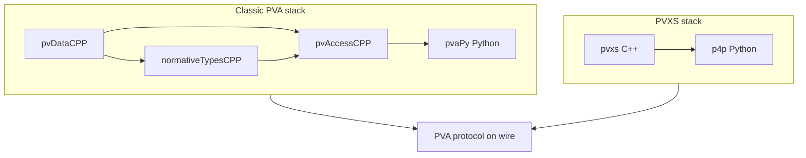

# Enable pvxs in pcaspy EPICS IOCs — Plan

This document summarizes the EPICS PVA (PVAccess) protocol stacks and evaluates migration options to provide pvxs/PVA access for existing pcaspy (CA-only) IOCs.

See also [pcaspy.md](pcaspy.md) for context and Option 4 (PyDevice) details.

---

## Part 1: EPICS PVA (PVAccess) protocol stack summary

**PVA** (PVAccess) is the protocol name. It supports Get, Put, Monitor, and RPC. There are **two independent C++ implementation stacks**; both speak the same PVA protocol on the wire.

### Stack A: Classic (EPICS 4 / EPICS 7.0)

| Component | Role |
|-----------|------|
| [pvDataCPP](https://github.com/epics-base/pvDataCPP) | Data containers (PVStructure, PVScalar, etc.); core of PVA data model |
| [normativeTypesCPP](https://github.com/epics-base/normativeTypesCPP) | Standard types (NTScalar, NTTable, etc.); builds on pvDataCPP |
| [pvAccessCPP](https://github.com/epics-base/pvAccessCPP) | PVA network protocol (client + server); uses pvDataCPP + normativeTypes |
| [pvaPy](https://github.com/epics-base/pvaPy) | **Python bindings** (Boost.Python) for this stack: client and PVA server |

Relationship: **pvDataCPP → normativeTypesCPP**; **pvDataCPP + normativeTypesCPP → pvAccessCPP**; **pvaPy** wraps pvAccessCPP (and thus the whole stack).

### Stack B: PVXS (modern, intended to supplant classic)

| Component | Role |
|-----------|------|
| [pvxs](https://github.com/epics-base/pvxs) | Single C++ library: data (`pvxs::Value`), PVA client, PVA server, QSRV 2, IOC integration |
| [p4p](https://github.com/epics-base/p4p) | **Python bindings** for pvxs (via [pvxslibs](https://pypi.org/project/pvxslibs)); PVA client and server API |

Relationship: **p4p** depends on **pvxs** (and EPICS Base). pvxs replaces the roles of pvDataCPP, normativeTypesCPP, and pvAccessCPP in one codebase; p4p is the Python face of that stack.

### Diagram (conceptual)

**Takeaway:** "pvxs in pcaspy" means using the **pvxs stack** (pvxs + p4p in Python), not the classic stack (pvaPy). Both stacks are PVA; they are not wire-compatible with CA (Channel Access), which pcaspy uses today.

---

## Part 2: pcaspy context

- **pcaspy** ([paulscherrerinstitute/pcaspy](https://github.com/paulscherrerinstitute/pcaspy)): Python **Channel Access (CA) server** only. It does **not** implement PVA.
- For a Python PVA server, **p4p** (Python bindings to pvxs) is the relevant option.

So "enable pvxs in pcaspy IOCs" means: **add PVA (via the pvxs stack / p4p) to IOCs that are currently implemented with pcaspy (CA only)**.

---

## Part 3: Migration options (evaluated)

### Option 1: Add PVA server alongside pcaspy (same process, p4p)

**Idea:** Keep the existing pcaspy IOC (CA server + Driver + PVs). In the **same Python process**, start a **p4p PVA server** and mirror each PV (or a subset) into p4p `SharedPV` instances. CA clients use pcaspy; PVA clients use p4p; both see the same logical PVs.

**Pros:** Reuse all existing pcaspy driver logic and Python; no C++ rewrite; p4p uses pvxs (desired stack).

**Cons:** Two servers to maintain and keep in sync; mirroring logic (scan/update from Driver → p4p `post()`) and type mapping (CA DBR → PVA/NTScalar) must be written and tested; same process must run both event loops (e.g. pcaspy thread + p4p server thread).

**Feasibility:** High. p4p Server API ([epics-base.github.io/p4p/server.html](https://epics-base.github.io/p4p/server.html)) supports `StaticProvider` + `SharedPV`.

---

### Option 2: External CA-to-PVA gateway (no change to pcaspy IOC)

**Idea:** Leave the pcaspy IOC as-is (CA only). Run a **separate process** that is a CA client and a PVA server: it subscribes to the pcaspy PVs over CA and re-serves them over PVA. Clients that need PVA talk to the gateway; clients that use CA talk to pcaspy as today.

**Implementations:**

- **P4P PVA Gateway** ([p4p gw](https://epics-base.github.io/p4p/gw.html)): PVA→PVA proxy. Does **not** speak CA.
- **PVA-i-fy** ([ControlSystemStudio/pvaify](https://github.com/ControlSystemStudio/pvaify)): CA→PVA proxy (Java). Connects to CA (e.g. pcaspy) and exposes those PVs over PVA.
- **Custom gateway:** Python (or C++) service: CA client (e.g. pyepics or pvaPy in CA mode) + p4p PVA server, mirroring selected PVs. Uses the pvxs stack (p4p) for the PVA side.

**Pros:** Zero change to pcaspy or existing IOC code; can be added incrementally per site.

**Cons:** Extra process and network hop; operational overhead; possible latency/behavioural differences; gateway becomes a single point for PVA access.

**Feasibility:** High. Use pvaify for a quick solution, or a custom p4p-based gateway if you want the pvxs stack explicitly.

---

### Option 3: Rewrite IOC in C++ (EPICS Base soft IOC + QSRV 2)

**Idea:** Replace the pcaspy IOC with a **C++ soft IOC** (EPICS Base): record types, device support, and/or calc/stream device support implemented in C++. Enable **QSRV 2** (pvxs) so it serves the same database over both CA and PVA ([pvxs IOC integration](https://epics-base.github.io/pvxs/ioc.html)).

**Pros:** Native dual protocol (CA + PVA) in one IOC; no mirroring; QSRV 2 is the recommended pvxs path for IOCs.

**Cons:** All current **Python** driver logic must be reimplemented in C++; large effort and skill shift; device support and record processing differ from pcaspy's Driver/SimplePV model.

**Feasibility:** Technically straightforward, but migration cost is high and is a full rewrite of the IOC application logic.

---

### Option 4: Migrate to PyDevice (C soft IOC + Python device support) + QSRV 2

**PyDevice** ([klemenv/PyDevice](https://github.com/klemenv/PyDevice)) is EPICS device support that embeds a Python interpreter inside a **C-based soft IOC**. Records use `DTYP="pydev"` and INP/OUT links like `@device1.connect()` or `@device1.sent`; record processing runs Python code. The IOC is a standard EPICS Base soft IOC (C), so it already serves CA; adding **QSRV 2** (pvxs) gives dual CA + PVA (pvxs) with no extra gateway.

**Migration path:** (1) Define an EPICS database (`.db`) with the same PVs, using record types supported by PyDevice (longin, longout, ai, ao, bi, bo, stringin, stringout, waveform, etc.) and `DTYP="pydev"`. (2) Move pcaspy Driver logic into Python modules that PyDevice calls from INP/OUT (e.g. `@mymodule.device.read()`). (3) Build the IOC with PyDevice and EPICS Base (and pvxs if desired). (4) Add QSRV 2 to the same IOC so it serves the database over PVA.

**Pros:** Standard EPICS architecture; Python keeps device/application logic; single process serves both CA and PVA (pvxs); no mirroring or gateway; PyDevice supports I/O Intr scanning via `pydev.iointr()` for push-from-Python updates.

**Cons:** Model change from pcaspy (Driver-centric) to record-centric (each record triggers Python); database and link syntax (`@...`) must be written/maintained; PyDevice supports a fixed set of record types; migration effort to map existing pcaspy PVs and Driver methods to records + Python calls.

**Feasibility:** High. PyDevice is an existing, maintained project (GPL-3.0); build requires EPICS Base and Python dev headers. pvxs/QSRV 2 integration is standard for any EPICS Base IOC.

---

### Option 5: Use pvaPy instead of pvxs for PVA in Python

**Idea:** Add PVA using **pvaPy** (PVA server API) instead of p4p. Same "dual server in process" or "gateway" patterns as above, but with the **classic** stack (pvDataCPP/pvAccessCPP).

**Pros:** Mature Python PVA server; supports both PVA and CA providers.

**Cons:** Not the pvxs stack; classic stack is expected to be supplanted by pvxs; build/runtime dependencies differ (Boost, EPICS 4 modules). If the goal is explicitly "pvxs in pcaspy IOCs," pvaPy does not deliver pvxs.

**Feasibility:** High for "PVA in Python," but it does not deliver pvxs.

---

## Recommended direction (for "pvxs in pcaspy IOCs")

- **Short term / minimal change:** **Option 2** – Run a **CA-to-PVA gateway** (e.g. pvaify or a custom p4p-based gateway) in front of existing pcaspy IOCs. No pcaspy changes; PVA clients get access via pvxs (if the gateway uses p4p) or classic PVA (if using pvaify).

- **Medium term / keep Python IOC, add pvxs:** **Option 1** – **Dual server in process:** extend the pcaspy-based IOC (or a thin wrapper) to start a **p4p** PVA server and mirror Driver-backed PVs into p4p SharedPVs. Delivers pvxs (via p4p) in the same process as the existing CA server.

- **Long term / standard EPICS stack:** **Option 3** – Migrate to **C++ soft IOC + QSRV 2** where the application allows, for native CA + PVA (pvxs) without Python in the IOC process. **Option 4** – Migrate to **PyDevice + QSRV 2** to keep Python device logic while using a standard EPICS soft IOC with native CA + PVA (pvxs).

---

## Suggested next steps (implementation phase)

1. **Prototype Option 1:** In a single pcaspy IOC, add p4p as a dependency; create one `p4p.server.Server` with a `StaticProvider`; for one or two test PVs, create `SharedPV` (e.g. NTScalar), open them, and update them from the pcaspy Driver. Validate PVA client access (e.g. `pvget`/p4p client or pvxs tools).

2. **Document type mapping:** CA DBR types (DBR_DOUBLE, DBR_LONG, etc.) → PVA/NTScalar and any metadata (alarm, timestamp) so the mirroring layer can be generalized.

3. **Evaluate Option 2:** Deploy pvaify or a minimal p4p CA→PVA gateway against a test pcaspy IOC; measure latency and behaviour vs direct CA; decide whether gateway is acceptable for your use cases.

4. **Decide scope:** Whether "pvxs in pcaspy IOCs" is only "PVA access to the same PVs" (Options 1 or 2) or also "future migration to C++ or PyDevice IOC" (Options 3 or 4); that will guide whether to invest in a reusable mirroring layer (Option 1) or keep gateway-only (Option 2).
